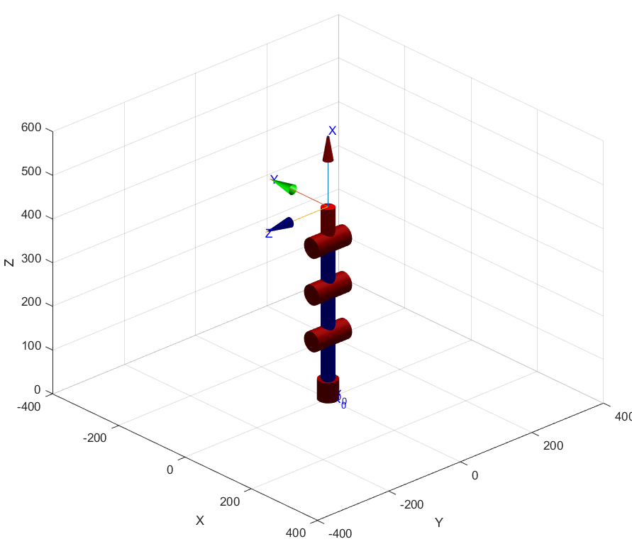
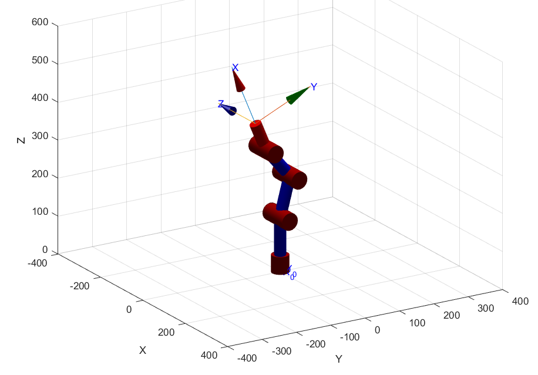
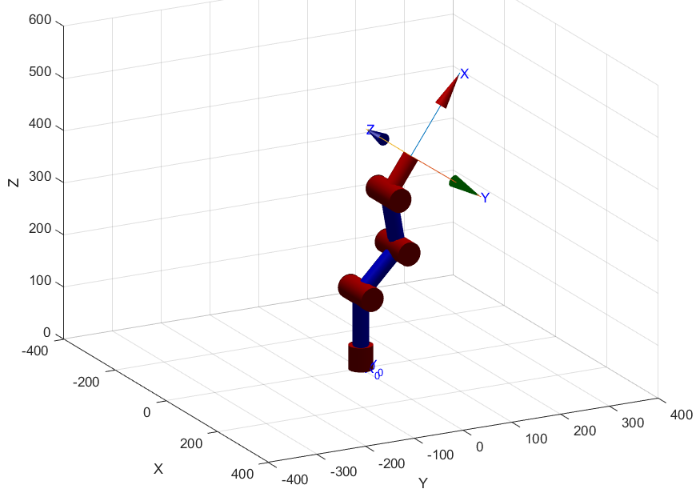

# Phantom-X
Repositoty for practices with a Phantom-X using the laptop keyboard and ROS .

> ## Contributors
> 
> - [Camilo Andrés Borda Gil](https://github.com/Canborda) (caabordagi@unal.edu.co)
> - [Brian Camilo Saiz Cavanzo](https://github.com/briansaiz) (brcsaizca@unal.edu.co)


## Cinematic analysis of the robot
The first step was take the measurements of the Phantom in the laboratory, obtaining the following results:
 - L1 = 145 [mm]
 - L2 = 107 [mm]
 - L3 = 107 [mm]
 - L4 = 80 [mm]

Then the reference systems are assigned according to the DHstd convention. 

<p align="center"></p>

Obtaining the following DH Parameters:

<p align="center"></p>

## Cinematic analysis of the robot with MATLAB
With the Toolbox of MATLAB and the previously found DH Parameter, a SerialLink object was created as follows

```matlab
l=[145,107,107,80];  %[mm]
offset = [0 pi/2 0 0];
L(1) = Link('revolute','alpha',pi/2,'a', 0  ,'d',l(1),'offset',offset(1));
L(2) = Link('revolute','alpha',0,   'a',l(2),'d',0   ,'offset',offset(2));
L(3) = Link('revolute','alpha',0,   'a',l(3),'d',0   ,'offset',offset(3));
L(4) = Link('revolute','alpha',0,   'a',l(4),'d',0   ,'offset',offset(4));
Robot2=SerialLink(L,'name','R2')
```
Achieving the following DH parameters

<p align="center"></p>

With the help of the plot command, the home pose is plotted:

```matlab
ws = [-1 15];
close all
q1 = [0 0 0 0];
figure(1)
Robot2.plot(q1,'notiles','noname');
hold on
trplot (eye(3),'rgb','arrows','length',15,'frame','0')
axis([repmat(ws,1,2) -4 5])
hold off

xlim([-400 400])
ylim([-400 400])
zlim([0 600])

view([47 26])

```

<p align="center"></p>

In the same way the robot was configured with the following poses
 - [-pi/9 pi/9 -pi/9 pi/9]  
<p align="center"></p>

In the same way the robot was configured with the following poses
 - [pi/6 -pi/6 pi/6 -pi/6]   
<p align="center"></p>

In the same way the robot was configured with the following poses
 - [-pi/2 pi/12 -11*pi/36 17*pi/180]  
<p align="center"></p>

In the same way the robot was configured with the following poses
 - [-pi/2 pi/4 -11*pi/36 pi/4]
<p align="center"></p>


Finally, with the help of the fkine command, the homogeneous matrix of the Phantom-X is found.

<p align="center"></p>

##ROS

##Implemantation
<video src="https://user-images.githubusercontent.com/aaa.mp4"></video>
##CONCLUSIONS
 - 
 - 
 - 
 - 
